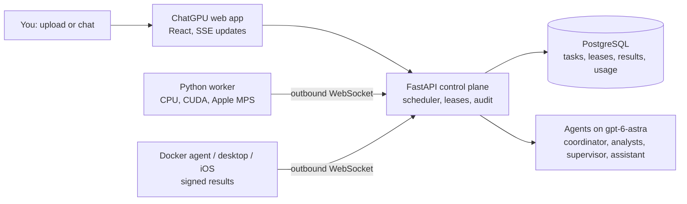
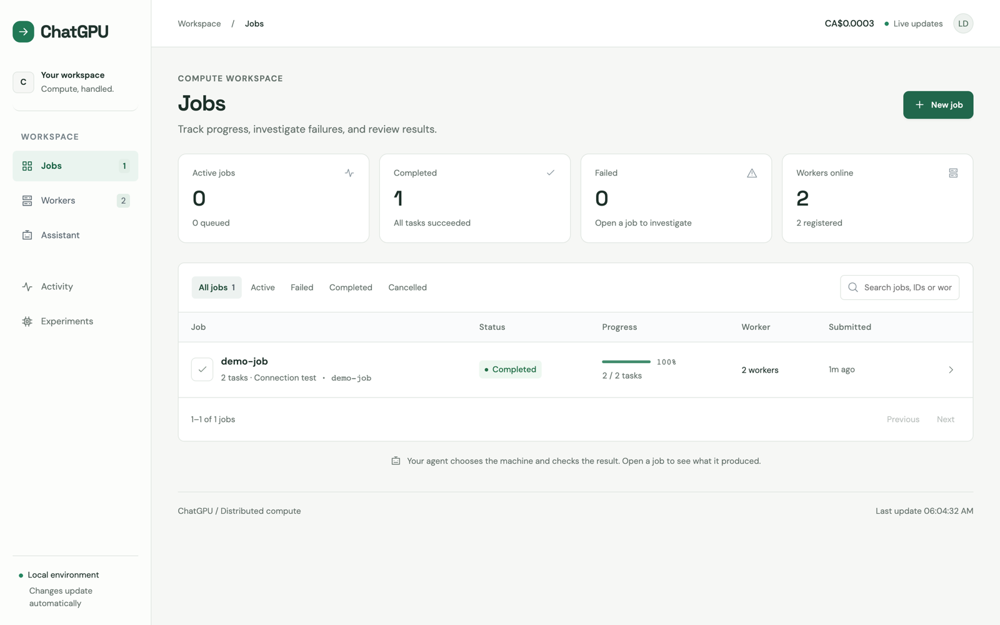
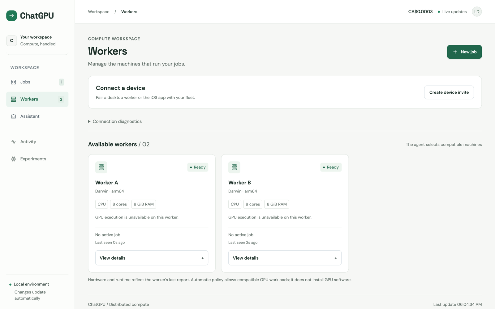
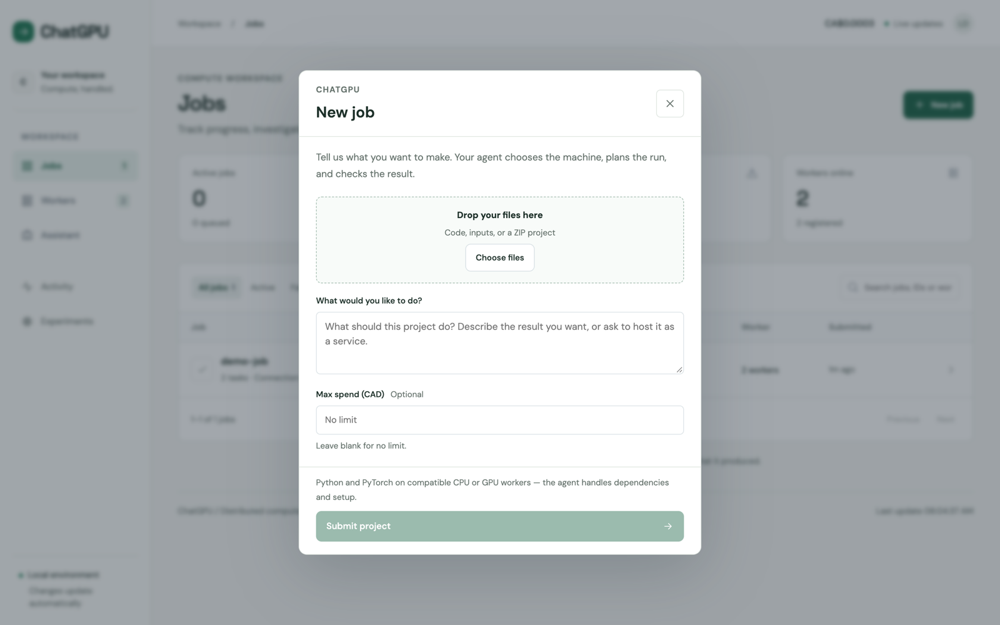
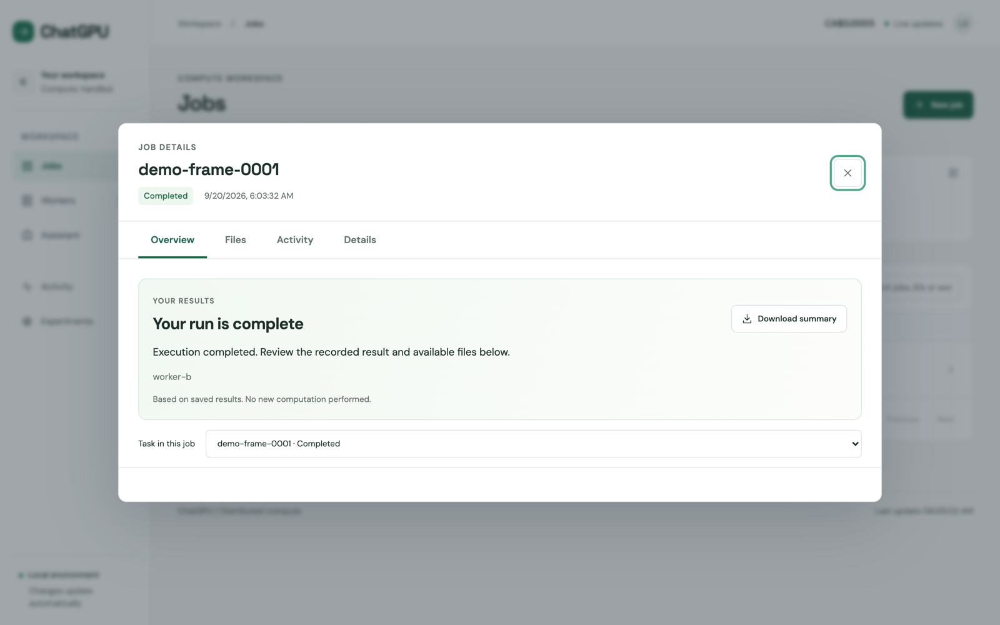
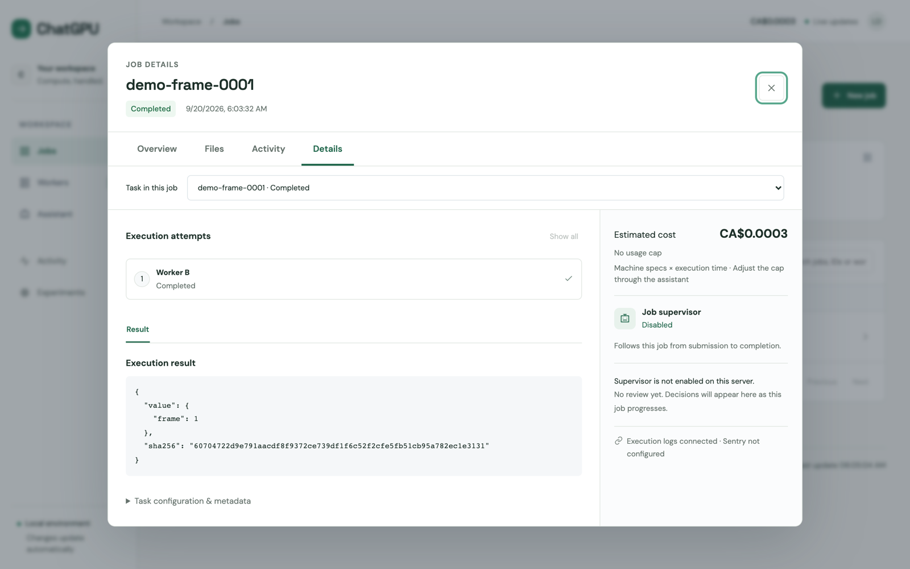
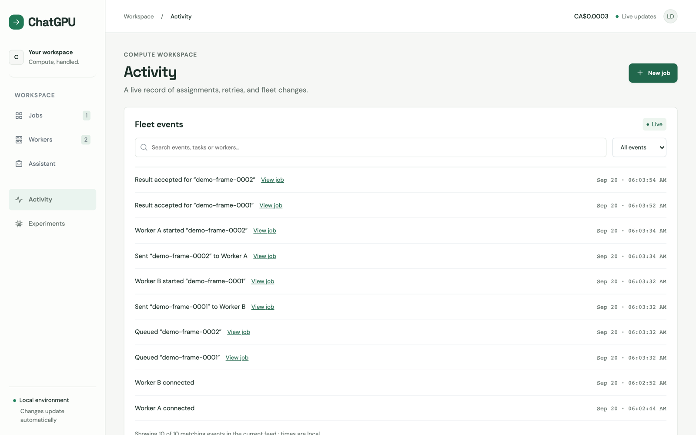
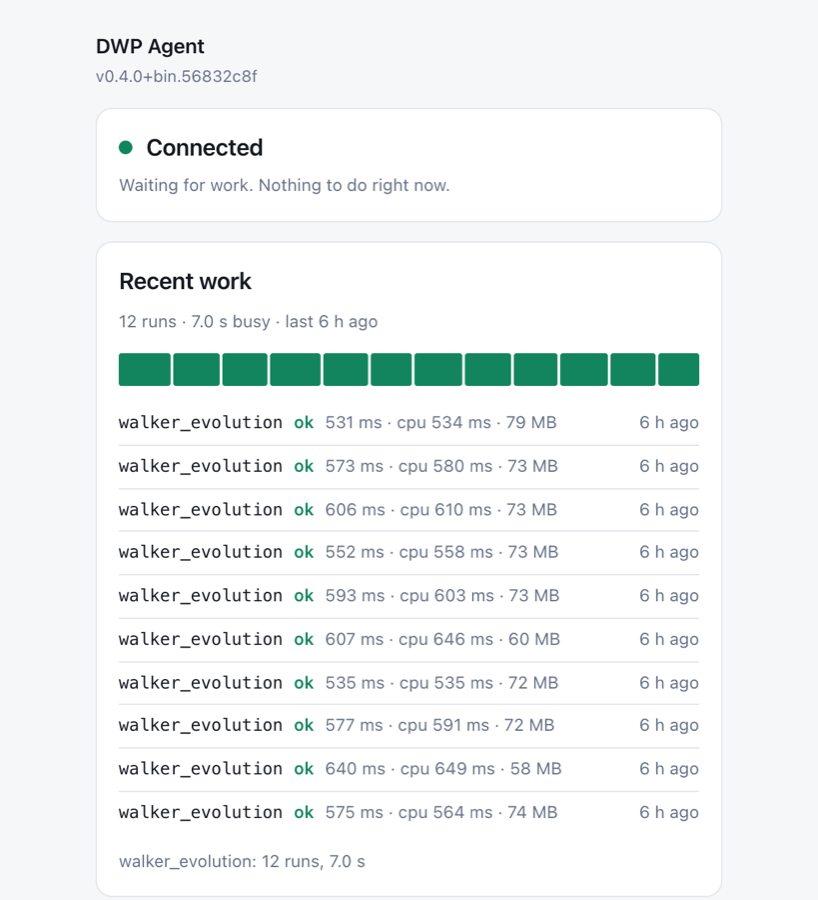

# ChatGPU · distributed compute workspace

ChatGPU connects machines you already own into one fleet and runs compute jobs
on them through agents. You upload Python files and describe the result you
want. An agent plans the run, picks a machine, executes it, validates the
output, and reports the cost. GPU Lab applies the same agents to model training
and inference on rented GPUs and reports speedups with before/after
measurements. A faster result that changes any answer is rejected.

## What it does

- **Fleet.** A laptop, desktop, container, or iPhone joins by running one
  container or pairing the desktop/iOS app. Machines connect outbound over
  WebSockets, so no inbound port is needed. PostgreSQL holds every lease and
  result.
- **Agents.** A planning coordinator reads the uploaded source, chooses runtime,
  dependencies, and worker, runs a short probe, then the full job and its
  validator. It asks the user only when information is missing. A supervisor
  agent watches each job. A fleet assistant answers questions in chat. Agents
  act only through validated tools, and job state is decided by the server.
- **Verification.** Workers run a tensor op on a GPU before advertising it.
  Paired devices sign every result with an Ed25519 key that stays on the
  device. A GPU speedup is accepted only when every answer on a fixed 300-case
  suite is unchanged.

## How it works



A request becomes one or more tasks in PostgreSQL. Workers pull the oldest
compatible task under a database lock, heartbeat every 5 seconds against a
45-second lease, and the server accepts a result only if the assignment is
still valid. A per-job supervisor and a metering trigger run alongside. The
Experiments view (GPU Lab) reads from the separate GPUShare service, which
holds the recorded GPU measurements.

## Screenshots

Captured from the local demo (`orchestrator-demo`) on September 20, 2026, with
two CPU workers and one completed connection test. No model key was configured,
so the assistant and supervisor show their unconfigured states.

| | |
| --- | --- |
| **Jobs.** Counts of active, completed, and failed jobs and online workers, then the job list.  | **Workers.** One card per machine with its reported hardware. A one-time invite pairs a desktop or iOS agent.  |
| **New job.** Files, a description, and an optional CAD cap.  | **Job overview.** Result, files, metrics, and a downloadable summary built from saved results.  |
| **Job details.** Execution attempts, the accepted result, estimated cost, and supervisor findings.  | **Activity.** Audit trail of queueing, assignment, starts, and accepted results.  |

<p align="center">
  
  <br><em>The desktop agent window: connection status, recent signed work, and a pause switch, served by the agent process.</em>
</p>

## What works today

| Area | You can | Limits |
| --- | --- | --- |
| Upload a job | Drop Python files or a ZIP, describe the result, set a CAD cap. The agent plans, probes, runs, and validates. | Python and PyTorch only. Process isolation, no sandbox. One program on one worker. |
| Concurrent analysis | The coordinator can start up to three analysis agents (dependencies, parallelization, validation). | Reports are advisory. Six child calls per job. |
| Monte Carlo simulations | Seeded trials are validated on two distinct workers against fresh seeds, then scheduled in waves. | Tolerance rel 1e-8. |
| GPU-aware placement | Workers verify CUDA and Apple MPS with a tensor op. Explicit GPU requests do not fall back to CPU. | No GPU rental. The device used is whatever the program reports. |
| Job supervisor | One agent per job wakes on failures and Sentry alerts, searches logs, and can retry, pause, or cancel. | Cannot raise attempt limits or edit payloads. |
| Fleet assistant | Ask which workers are free, submit supported workloads, inspect or cancel tasks, adjust a run's cap. | 8 tool calls and 90 s per turn. No uploads or shell. |
| Hosted services | Upload an HTTP server and ask to host it. Authenticated endpoint under `/serve`. | One worker gateway process. |
| Devices and signing | Desktop and iOS agents pair with a one-time invite and sign every result. | iOS is a developer build. Python workers use enrolled tokens. |
| Usage and credit | Every attempt is metered in CAD from cores and RAM. A per-run cap cancels the job. | Estimates only. No payments. Soft cap. |
| Experiments (GPU Lab) | Workflow commands such as `/compare saved MI300X` open recorded evidence: latency ratio, verdict, and the changed answers. | Backed by the separate GPUShare service. Recorded mode by default. |

Recorded GPU evidence (GPUShare, Qwen2.5-0.5B, 13 sentences x 5 rounds, 300-case
exact-value check): A5000 1.383 s to 0.234 s (5.91x, accepted, 0 changed
answers); L40S 1.702 s to 0.254 s (6.69x, accepted); MI300X 1.136 s to 0.248 s
(4.58x, rejected, 13 of 300 answers changed). No migration from the original
RTX 4090 passed the check.

## What's in flight

- **PR #25** adds a pre-training loop that proposes and benchmarks native CUDA/HIP
  kernel edits, translates CUDA to HIP for AMD targets, and accepts only if faster
  on every shape and numerically identical. Tests pass on synthetic GPU reports;
  a live NVIDIA plus AMD run is still needed.
- **GPUShare branches** (`integrate/gpushare-platform`, `ji-phin-agentinfra`,
  `relay/gpu-safety`) hold the training, optimization, and migration work, the
  recorded hardware matrix, and the Relay marketplace agents with three approval
  gates. They share no git history with `main` yet.

Not on `main`: GPU rental, job splitting across machines, the marketplace,
automatic deploy or rollback.

**Status:** one Python/Supabase control plane with a React dashboard, Python
workers with verified CPU/CUDA/MPS runtimes, and paired desktop/iOS workers.
Desktop workers execute signed echo tests, deterministic walker simulations,
optional ONNX inference, and uploaded Python projects. GPU rental, job splitting,
machine scoring, and validation of the combined system on remote hardware remain
separate work.

## Run the app

The app uses Supabase authentication and PostgreSQL. Configure the root `.env`
from `.env.example`, including your public origin, Supabase project, database,
worker tokens, and approved admin emails or user IDs. Then:

```sh
npm --prefix frontend ci
./scripts/start-app.sh
```

This starts the public API, private worker gateway, and frontend. In this
workspace, open **https://localhost:5174** to create an account and sign in.
Approved email addresses receive fleet access only after email confirmation.
The dashboard shows registered workers and real database state.

Set `OPENAI_API_KEY` and `OPENAI_MODEL=gpt-6-astra` in the backend environment to
enable the **Fleet assistant** chat panel. It can inspect the fleet, submit the
existing workloads, and inspect or cancel tasks. Conversations and tool activity
are saved privately on the backend. Restart the backend after changing configuration.

See [frontend setup](frontend/README.md) for HTTPS and Supabase email redirects,
and [networking](docs/networking.md) for hosting the website and connecting
workers. The optional `orchestrator-demo` commands remain available for isolated
tests; the app launcher does not use them.

## Add a machine

A machine joins the compute network by running one container:

```sh
docker run -d --restart unless-stopped -v dwp-agent-data:/data -p 127.0.0.1:43117:43117 \
  -e DWP_INVITE='https://your-control-service/join?code=CODE' dwp-agent:latest
```

Nothing is compiled per platform and nothing needs a port open: the agent dials out, so
a machine in another country joins the same way one in the next room does. The window at
`http://127.0.0.1:43117/` is the same desktop app as before — status, recent work, the
pause switch — served by the agent process itself.

Whoever you invite does not need this repository. The image is published to
`ghcr.io/<owner>/dwp-agent` by `.github/workflows/agent-image.yml`, and the `/join` page
their invite link points at gives them that command with their code already in it. See
[the agent as a container](docs/docker-agent.md) for publishing, several agents on one
host, optional ML workloads, and putting the container on a tailnet.

## Project layout

```text
HTN/
├── frontend/                # React website, browser auth, and UI tests
├── backend/
│   ├── src/orchestrator/
│   │   ├── server/          # Public API, private worker gateway, auth, database
│   │   ├── worker/          # Worker agent and workload executors
│   │   ├── client/          # Python client, CLI, and agent tools
│   │   ├── shared/          # Protocol models and credential helpers
│   │   └── demo.py          # Local demo launcher
│   ├── tests/               # Unit and local PostgreSQL integration tests
│   ├── pyproject.toml       # Python dependencies and entry points
│   └── uv.lock
├── deploy/                  # Dockerfiles (backend, worker, agent), Compose, HTTPS proxy
├── transport/tailscale/     # Embedded worker tunnel (Go / tsnet)
├── docs/                    # Architecture, setup, API, and validation guides
├── examples/                # Runnable client and task fixtures
├── .env.example             # Supabase / public website configuration template
└── .env.local.example       # Local Docker development configuration template
```

`shared/` defines the contracts. Server, worker, and client implement their own
sides of those contracts. New workload executors belong under `worker/executors/`;
the future job planner can use the client API to submit its split tasks.

Hosted entry points are `orchestrator-public` and
`orchestrator-worker-gateway`. Other command names are stable: `orchestrator-server`, `orchestrator-worker`,
`orchestrator-demo`, and `orchestrator`. Module entry points are also available:
`python -m orchestrator.server`, `python -m orchestrator.worker`, and
`python -m orchestrator.client`.

## Guides

- [The agent as a container](docs/docker-agent.md): one image instead of five binaries,
  joining from an invite in the environment, several agents on one host, and the
  end-to-end fleet check.
- [Desktop and iOS integration](docs/jack-integration.md): device invites, real workloads,
  signed results, releases, Sentry, and validation.
- [Automatic worker enrollment](docs/worker-enrollment.md): Supabase sign-in,
  backend-issued Tailscale keys, and the worker setup command.
- [Bundled backend](docs/bundled-backend.md): website API and private gateway on one host,
  with Tailscale included; supports local development.
- [Bundled worker](docs/bundled-worker.md): embedded Tailscale, enrollment, and worker image.
- [Public website and private workers](docs/networking.md): Supabase login/database,
  separate public and worker listeners, and Tailscale Serve setup.
- [Architecture and API](docs/architecture.md): leases, scheduling, protocols, and limits.
- [Frontend](frontend/README.md): React development, hot reload, and builds.
- [Development](docs/development.md): local setup, containers, checks, and contribution boundaries.
- [Agent interface](docs/agent-interface.md): client, CLI, tool schemas, and examples.
- [Service hosting](docs/service-hosting.md): upload an HTTP service, obtain a stable endpoint, and recover worker failures.
- [Model client](docs/model-client.md): standalone OpenAI calls, separate from the agent loop.
- [Fleet assistant](docs/fleet-assistant.md): chat UI, agent loop, tools, and recovery.
- [Run usage](docs/usage.md): estimated execution costs and assistant-controlled per-run caps.
- [Validation](docs/validation.md): completed checks and remaining failure scenarios.

## Checks

```sh
npm --prefix frontend test
npm --prefix frontend run build
pnpm install --frozen-lockfile
pnpm typecheck
pnpm test
pnpm check:gui
pnpm docker:build && pnpm docker:test -- --agents 4 --tasks 24
uv run --project backend python -m unittest discover -s backend/tests -v
uvx ruff check --config backend/pyproject.toml backend/src backend/tests examples/agent_task.py --select F,I
uv build --project backend
```

Your root `.env` holds local Supabase configuration and is ignored by Git.
`.demo/` holds local demo data; `.local/` holds local certificates and tooling.
The Python environment lives in `backend/.venv/`. All are ignored.
The app requires an approved admin email or user ID and a matching public origin.
