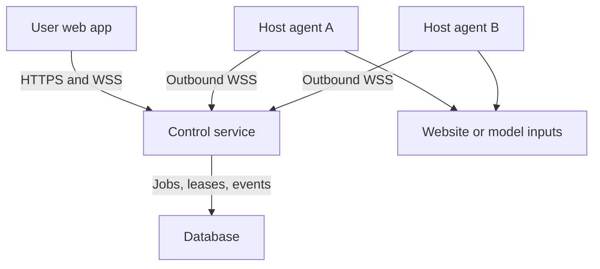

# Distributed Work Platform: MVP, Architecture, and Claude Handoff

**Version:** 2026-09-18 planning draft  
**Status:** Ready for architectural review; no implementation authorized by this document alone  
**Intended audience:** Project team, technical reviewer, and Claude implementation agent

## 1. What we are building

A user-owned **distributed work platform**. People enroll computers they own or explicitly trust. From one web interface, a user submits a supported type of work; the platform picks eligible computers, sends them tasks, and shows where work ran and what it produced. A remotely operated browser is **one supported workload** on an enrolled computer. Batch CPU inference is another. They share enrollment, authorization, scheduling, telemetry, and run history, but have different execution and security rules.

The platform is the coordinator. It is **not** a company-owned GPU fleet, a magic way to turn every web page into a compute worker, or a claim that every program can be split across computers. “Any task” is the long-term plugin model: a task type needs an executor, input/output contract, permissions, resource limits, and a placement rule. The first version implements two task types end to end.

**Initial user:** a small team with two or more trusted machines on different networks, wanting to pool idle compute or run an authorized browser workflow from a chosen remote machine. A later marketplace of unrelated people's laptops would require a separate trust, liability, payments, and abuse program.

**Product promise we can test:** “Enroll a second computer, run a real job on both computers from one dashboard, and open a controllable browser on an authorized host.” Improving inference speed or cost is an empirical question, not an MVP guarantee.

## 2. Direct answers to the connection questions

| Question | Answer for this plan |
| --- | --- |
| Can I use a browser on my own laptop to connect to another computer? | Yes, **if that computer opts in and runs a host agent** that establishes an authenticated connection to the control server. The user-facing dashboard is a browser app. No inbound port forwarding is required in the central-relay design. |
| Can any computer just visit a web page and become a full host? | No. A browser page is constrained by browser permissions, background execution, local device access, and lifecycle. Screen sharing, for example, prompts the user and requires user activation. A browser-only worker can be an experiment for limited tasks, but cannot be the reliable general host for this MVP. [MDN screen capture permissions](https://developer.mozilla.org/en-US/docs/Web/API/MediaDevices/getDisplayMedia). |
| Can I connect to “anything else” on a host's local network? | Only an explicitly enrolled host or an authorized integration with a defined interface. Do **not** treat enrollment as permission to scan its LAN or control other devices. LAN connectors require a separate adapter, allowlist, and owner's consent. |
| Can I borrow a computer in another country to browse? | Yes, if that computer is browser-enabled and its owner consents. The site is fetched by the **remote** browser, so the site's observed source IP is normally the host's network egress; a host VPN or proxy can change that. The dashboard streams pixels and forwards input. Region-specific access can still depend on account settings, geolocation, and website rules. |
| Is a VPN necessary? | No. A host-initiated encrypted connection to the server is sufficient for the first version. A private mesh VPN may simplify a trusted prototype; a direct or relayed WebRTC connection is an upgrade for lower-latency streaming. NAT/firewall traversal may require TURN relay. [MDN WebRTC protocols](https://developer.mozilla.org/en-US/docs/Web/API/WebRTC_API/Protocols). |
| Can a stranger's host safely hold my logged-in session? | Assume **no**. Its owner controls the execution environment and may access browser state. A separate browser profile keeps sessions separated from other users, but does not protect a guest from the machine owner. Logged-in browser sessions must use trusted or managed hosts. [Playwright browser context isolation](https://playwright.dev/docs/browser-contexts). |

For this MVP, **browser client** means the user's web dashboard; **host agent** means software installed on an opted-in Mac, Windows, or Linux computer; **remote browser** means the isolated Chromium instance the host agent launches. These are three different components.

## 3. Scope and checkpoints

### Checkpoint A — connectivity proof, before building the full UI

**Goal:** establish that the actual two-computer topology works.

1. Run a minimal public HTTPS/WSS control service. Connect host A from one network and host B from a different network. At least one must sit behind ordinary home NAT. Avoid manual inbound port forwarding.
2. Each host explicitly enrolls with a short-lived pairing code, opens an **outbound** authenticated connection, advertises a minimal capability record, and sends heartbeat updates.
3. From the client browser, request an approved `echo` task on each host. Return host ID, elapsed time, and a nonce; verify that each host actually ran its own task. Disconnect one host and see an offline transition.
4. On one **trusted** host, launch an isolated remote Chromium session and open a demo site under the team's control with `/whoami`. Verify that this site sees the remote host's egress IP. Send click/type input from the client and observe a changed page.

**A passes when:** the two real computers work over different networks; control remains encrypted; no inbound port opening is needed; both independently execute; remote browser input and video/frames work; the observed site request comes from the remote browser host. If any fail, investigate the network/runtime before building the full product.

### Checkpoint B — interim MVP

**Goal:** demonstrate actual distributed work and one remote browser workload in the same product.

- One web app for login, enrollment, host availability, batch-job submission, live distribution, results, and a remote browser session.
- Two or more trusted enrolled hosts; first support macOS and Windows or two OSes the team physically owns. A Linux VM can supplement testing, but cannot substitute for the cross-network two-computer proof.
- A real **bounded CPU inference** workload, such as running a pinned small ONNX classifier over independent example inputs. The host downloads a pinned model and fixed test inputs once, verifies hashes, then executes independently assigned batches. Record model/preprocessing versions and numerical tolerance. ONNX Runtime's Node binding publishes CPU builds for Windows, Linux, and macOS; GPU availability varies by OS and execution provider. [ONNX Runtime Node platform table](https://onnxruntime.ai/docs/get-started/with-javascript/node.html).
- A trusted-host browser workload: start a new browser context, view the session in the web UI, click/type/scroll, run one approved scripted workflow, pause it for human input, resume, and close it. Use a site the team operates or has permission to automate. Playwright supports separate browser contexts with separate cookies and local storage; that isolation is between sessions, not protection against the host administrator. [Playwright isolation](https://playwright.dev/docs/browser-contexts).
- Honest run metrics: host ID per task, queue/start/finish timestamps, task result counts, failures/retries, measured network bytes if available, and a same-workload single-host baseline.
- A local “Stop offering resources” switch on each host, resource caps, and kill/cancel controls in the dashboard.

### Checkpoint C — conditional follow-on, after measurements

If A and B pass, improve browser smoothness with WebRTC/TURN, add model-aware placement and optional GPU executors per supported platform, broaden OS support, then evaluate less-trusted hosts. A public rental marketplace, cross-chip code migration, arbitrary shell execution, mobile device control, consumer geo-unblocking, and automated access to private accounts are **outside** the interim MVP.

## 4. System architecture

The control service authenticates people and hosts, checks permissions, chooses placements, grants time-limited task leases, routes browser input/frames for the prototype, and records events. Only the selected host fetches the target site when a remote browser job runs. The control service must not accidentally proxy the browser's website traffic through the user's own network if remote egress is the intended feature.

**Suggested MVP stack, to validate against the team's skills:** React/TypeScript web client; TypeScript Node control API with WSS; PostgreSQL for durable state and atomic job leases; TypeScript Node host agent; Playwright Chromium for remote-browser sessions; ONNX Runtime Node CPU for the inference adapter. Host agent is a user-launched process for the first prototype; package it as a signed installer/service only after the topology works. Choose supported stable versions and pin them in a lockfile at build time; do not assume a named version remains current.

**Streaming choice:** first prove browser interaction with throttled screenshots or a Chromium screencast relayed over authenticated WSS, plus typed input events. This is an interactive prototype, **not** a promise of fluid full-desktop video. Measure end-to-end input-to-visible-frame latency and bandwidth. If the experience is too choppy, move media to WebRTC with TURN fallback while keeping authenticated control and host placement in the control service. Do not expose Playwright/CDP remote-debugging endpoints directly to users or the open internet. Chrome documents cookie extraction risks from remote debugging and recommends separate browser data directories. [Chrome remote-debugging security](https://developer.chrome.com/blog/remote-debugging-port).

### Workload contracts

Define an extensible `WorkloadAdapter` interface; implement exactly these adapters first:

| Adapter | Inputs | Placement | Execution | Outputs |
| --- | --- | --- | --- | --- |
| `cpu_inference_batch` | Pinned model hash, versioned preprocessing ID, immutable input manifest, batch IDs, timeout | Hosts advertising compatible CPU runtime, sufficient memory, consent for compute | Run independent input batches; do not split one model request across networked machines | One prediction/result per input, timing, host ID, errors |
| `remote_browser_session` | Target URL from a team-controlled allowlist, viewport, session owner, time limit | **Trusted, browser-enabled** single host; optional chosen egress region | Isolated Chromium context; authenticated live view; bounded input/actions; host-initiated fetch | Live frames, page actions, session event log, observed host egress |

A browser session is **pinned to one host**. On disconnect, end the session and require user reconnection or explicit recovery; migrating cookies and live page state between unrelated laptops is not part of this MVP. Independent inference batches, in contrast, can be reassigned on failure.

### Minimum record shapes

- `User`: ID, identity, role.
- `Host`: ID, owner ID, trust tier, approved workload types, online status, OS/architecture, available CPU/RAM, concurrency caps, observed egress IP if explicitly shown, coarse self-reported region, last heartbeat, agent version, revoked timestamp.
- `Job`: ID, owner ID, adapter type, status, manifest hash, total items, created/start/end times, requested constraints, cancellation flag.
- `Task`: ID, job ID, immutable input slice, assigned host ID, lease ID and expiry, attempt count, state, timestamps, idempotency key, output reference/hash, error class.
- `BrowserSession`: ID, owner ID, selected host ID, consent and access scope, starting URL, created/expires/ended times, state; never write passwords or cookies into the control database.
- `RunEvent`: append-only job/task/session event with server timestamp, event ID, host ID, actor, and category. Keep sensitive page contents out of default logs.

**Possible API/events:** `POST /hosts/pair-code`, host `WSS /agent/connect`, `GET /hosts`, `POST /jobs`, `GET /jobs/:id`, `POST /jobs/:id/cancel`, `POST /browser-sessions`, `POST /browser-sessions/:id/stop`, `WSS /runs/:id/events`, and an authorized browser media/input channel. These are planning contracts; Claude should refine names, schemas, auth, and message ordering before coding.

### Scheduling and failure behavior

1. Filter by explicit host consent, workload support, online heartbeat, free capacity, memory, trust tier, approved URL/region if requested, runtime/model compatibility, and per-user quota.
2. For CPU inference, use a **transparent measured heuristic**, initially a small calibration batch on each eligible host. Estimate completion time as queue delay + model/setup transfer + assigned work / measured throughput; place batches to minimize the slowest host's estimated finish, with a conservative reserve for offline hosts. Honor resource caps and any price ceiling if pricing is later introduced. Do not select the “fastest” machine by raw GPU name or default to the most expensive node.
3. Store tasks durably and grant short leases. A host acknowledges a task, sends a heartbeat, executes, and reports a result keyed by task ID/attempt. Expired uncompleted leases return to the queue. Accept a result once per task ID; make retries safe. Cancelling prevents new leases and signals active tasks; handle partial results explicitly.
4. Browser sessions select **one** eligible trusted host and maintain exclusive control for the authorized user. A dropped host ends the browser session and does not silently move its authentication state.

An AI scheduler can be studied later once repeated comparable observations exist. The MVP's value is visibility and correct placement, not a trained model predicting every possible job or automatic conversion of CUDA code to AMD.

## 5. Security and consent rules for this prototype

1. **Explicit host enrollment and controls.** Owner chooses compute and/or browser capability, time/resource limits, and can pause or revoke immediately. No default access to OS desktop, camera, microphone, clipboard, SSH, filesystem, or LAN devices.
2. **Transport and authorization.** HTTPS/WSS for browser, agent, and control service; short-lived pairing token exchanged for device credentials; rotate/revoke credentials; one owner-scoped session token for browser viewer/controller; audit pairing and control events. Protect the host's local credential file with OS permissions. Avoid exposing raw CDP/Playwright endpoints.
3. **Browser isolation.** New browser context/profile per session, no connection to the host's personal browser profile; close and delete ephemeral session state on stop. Separate profiles prevent cross-session cookie reuse, but do not make a stranger's host trustworthy.
4. **Bounded destinations.** For the MVP, use only team-operated/demo domains; block attempts to reach localhost, private-network ranges, metadata endpoints, and redirects outside the allowlist. A general-purpose remote browser needs a more thorough URL/DNS/redirect and abuse design before public rollout.
5. **Bounded compute.** The inference adapter runs a known model and validated input format with resource/time caps. **Do not** accept arbitrary uploaded code or shell commands on friends' laptops in the MVP. Longer-term code jobs require robust isolation, process/resource limits, and a clear host risk model.
6. **Trust boundary.** No real account logins or sensitive datasets on unknown hosts; use test accounts or public demo pages. The host owner can potentially inspect guest data and the site's traffic appears to come from the host. If the platform relays plaintext frames at its server, the platform operator can potentially observe them too; end-to-end media encryption would be a later, separate guarantee.
7. **Actions and abuse.** An agent may act only within the user's approved site/session and task scope. Require a visible handoff/approval for consequential actions (purchases, messages, account changes). Respect destination site rules; do not market cross-region browsing as guaranteed restriction bypass.

## 6. The product interface and an engaging demo

### Five screens

1. **Fleet:** live cards for each opted-in computer; owner, trust tier, OS, CPU, available RAM, allowed work types, connected/disconnected, measured throughput, and an honest egress indicator. “Pause host” is prominent.
2. **New work:** choose “Batch inference” or “Remote browser”; upload/select a fixed example dataset or enter an approved URL; choose “auto place” or a specific trusted host; show expected placement constraints before launch.
3. **Run map:** animated task lanes for A/B hosts, each task's actual assignment/start/result, throughput and retries, measured elapsed time, best-single-host comparison with baseline run ID and timestamp. Display transfer/startup overhead so a slower distributed run remains informative.
4. **Browser live view:** embedded remote page, clear “Running on Host B; site sees Host B egress,” host/trust label, visible control owner, pause/stop, one approved workflow button, and human takeover. If frame streaming is screenshot based, show the measured refresh rate; do not imply 60 fps.
5. **Run history:** reproducible input/model manifest hashes, tasks by machine, observed failures, result download, methodology for speed comparison.

### Three-minute presentation sequence

1. Show two real computers connected from **different networks** with distinct host IDs. Show a simple topology and current consent flags.
2. Submit a real batch of independent inference inputs. Task tiles fan out and independently complete on A and B. Show result count and a previously measured single-host baseline with its run ID; compare the same model/data/input setup. If distributed execution is slower, show why (cold start, transfer, network) instead of hiding it.
3. Launch a browser session on trusted Host B. Open your own `/whoami` demo page and show the website's observed IP next to the host's observed egress; type/click from the user's browser and run the approved scripted action.
4. Pause Host B or disconnect it. Show no new tasks placed there, an incomplete batch re-queued, and the browser session ending visibly. This proves orchestration and explains the different failure semantics.

The browser demo establishes **remote access and workflow placement**, not an inference speedup. The batch demo establishes **actual distributed computation**, not a generic remote desktop. Combined, they demonstrate why the platform has more than one workload type.

## 7. Measurement plan and pass/fail gates

Run tests on two actual enrolled machines over separate internet connections; log OS, CPU, network connection, agent version, model hash, number and sizes of tasks, and timestamp. Do at least three warm repeated trials per configuration. Compare distributed run against the **faster single eligible host** on the same inputs and model, with identical preprocessing and a documented cache state. Report median and range; record job runtime from submit to last correct result, per-host busy time, and transfer/setup time. Speedup is `single-host wall-clock / distributed wall-clock`; values under 1 mean distributed was slower.

| Gate | Pass criterion | If it fails |
| --- | --- | --- |
| Network | Two hosts on distinct networks enroll and execute tasks with only outbound connections; no manual inbound port forwarding | Fix control-plane connectivity/NAT assumptions before UI polish |
| Proof of distribution | Server event log and results show real work executed on both physical hosts; no precomputed/fake route | Fix dispatch and result provenance |
| Correctness | All input IDs have exactly one accepted result; predictions match single-host output within documented model tolerance | Fix manifest, idempotency, preprocessing, and retry handling |
| Recovery | During an active batch, losing a host reassigns unfinished leased tasks; completed results are not duplicated; browser session terminates visibly | Fix leases, heartbeat expiry, and session lifecycle |
| Browser egress | Team-owned demo site observes the intended host's public egress address; user can type/click/scroll remotely | Check which component fetches pages, controls, or routes traffic |
| Security | Unenrolled/revoked host rejected; a different user cannot control a session; host can pause; forbidden URL targets rejected | Stop broader trials and close access-control gaps |
| Usability | Team can reproduce the end-to-end setup from a fresh host using README without shell-only manual database edits | Simplify pairing and setup flow |
| Performance claim | Publish the measured speedup and overhead. Claim speedup only if median is **above 1.0** against the faster single host; evaluate usefulness and consistency before setting a marketing threshold | If consistently <=1, keep connectivity/browser platform as validated but change the workload or scheduling economics |

**Optional stretch target:** for a workload where computation dominates setup and transfer, aim for at least 1.2× median speedup on two roughly comparable hosts across three warm trials. This is a project target, **not** an assumed outcome or a criterion for whether remote connectivity itself works.

## 8. Delivery order and explicit exit conditions

| Pass | Work | Exit evidence |
| --- | --- | --- |
| 0. Architecture review | Threat model, chosen stack, diagrams, contracts, runtime support, allowed destinations, risk register, test protocol | Reviewed design with unresolved questions marked; no false security claims |
| 1. Network spike | Public control server, pairing, two outbound agents, heartbeats, echo tasks, browser `/whoami` | Gate A screenshots/logs from separate networks |
| 2. Batch compute | Pinned model/data, inference adapter, manifest, scheduler, leases, correct results and baseline | Both hosts execute independent batches; correctness and recovery tests pass |
| 3. Browser workload | Trusted-host Playwright Chromium context, constrained URLs, frames/input, human takeover, stop | Remote page really loads on host, reacts to input, and reports remote egress |
| 4. Interface | Fleet, New work, Run map, Browser live view, history; real event stream | Whole demo works without editing DB or impersonating host events |
| 5. Hardening and demo rehearsal | Host caps, per-session access checks, cancellation, revocation, disconnect handling, metrics, README | Gate table passes and measured claims match the UI |

**Rough sizing, not a delivery promise:** pass 1 is a short feasibility spike; passes 2–5 are materially larger due to job durability, security boundaries, remote browser controls, and observability. If time is tight, cut model variety, GPU support, and AI planning; preserve the two-real-host proof, one correctly measured parallel job, and one trusted remote browser session.

## 9. Prompt to give Claude for an architectural plan

Copy the text below together with this entire document. Request a review before implementation.

> You are the lead systems architect for this project. Read the attached “Distributed Work Platform: MVP, Architecture, and Claude Handoff” in full. The platform schedules **users' work on opted-in users' machines**. Browser sessions and CPU inference are two user-facing workload types; the platform does not use these hosts merely to power its own internal service. We need a browser dashboard, an installed/opt-in host agent, a public control service, two real machines on distinct networks, one measured distributed CPU inference batch, and one trusted-host interactive browser session whose website traffic exits from the chosen host.
>
> First produce a structured implementation architecture **without coding**. Include: (1) precise components and data/control/media paths, with who can see which secrets; (2) host pairing, authentication, revocation, NAT behavior, transport choices, and no exposed CDP; (3) browser capabilities versus required installed host agent; (4) proposed repository layout and technology choices with supported OS/runtime evidence; (5) typed API and WebSocket event contracts, database schema, task state machine, lease/retry/idempotency rules; (6) adapter interface and the two initial adapters; (7) scheduling objective with eligible-host filters, calibration, transfer/setup cost, and a concrete worked two-host example; (8) authorization and host-consent matrix; (9) threat model for host owner, job submitter, platform operator, target sites, and accidental LAN access; (10) browser interaction/stream transport tradeoffs and measured upgrade trigger; (11) test/benchmark protocol and exact phase gates; (12) top five failure modes and remedies; (13) a prioritized implementation backlog with acceptance criteria.
>
> Challenge anything infeasible or overclaimed in the handoff; distinguish verified facts from assumptions and cite official vendor/browser/runtime documentation for version-dependent claims. State whether a two-computer cross-network demo is achievable under the stated constraints. Keep untrusted public hosts, unrestricted code execution, logged-in private accounts on stranger hosts, mobile host control, cross-chip translation, and marketplace payments out of the initial build. Ask only questions that truly block the architecture; otherwise write explicit assumptions. End with a **go/no-go review** and unresolved decisions. Do not start coding until the team approves this plan.

## 10. Prompt to give Claude for the build, after reviewing its architecture

Use this only once its architectural response is acceptable; attach that response and this document.

> Implement the agreed interim MVP in small reviewable passes. Start with pass 1: run a real public HTTPS/WSS control service; connect two real opt-in host agents from different networks without inbound port forwarding; show pairing, presence, and independently executed echo jobs; then prove a trusted host launches a separate Chromium context and `/whoami` observes that host's egress. Demonstrate and document this gate before continuing.
>
> Then implement the durable two-host CPU inference workload and measured baseline; remote browser viewer and controls; run map and history; security controls; and fault recovery. Use real host events and real results. Build only the two approved workload adapters. Never simulate distribution, mislabel a cloud-only run as peer-to-peer proof, expose a debugging port, accept arbitrary shell/code uploads, or run private-account logins on an untrusted host. Include setup instructions, configuration examples without secrets, meaningful integration tests, a reproducible two-network manual test, benchmark logs, and screenshots or a short demo capture. At each pass report exactly what runs, on which computer, what was measured, what failed, and what remains. Stop at a broken pass gate and fix it before adding features.

## 11. Assessment and decision

**Is the project plan good?** Yes, as a **trusted-device, two-workload feasibility MVP**. It tests a real distributed connection and a real browser session using the same control plane. It is achievable with an opt-in agent and a publicly reachable coordinator; it does not depend on universal chip translation or training a scheduler. The architecture is extensible without claiming every arbitrary job works now.

**What might invalidate the product thesis?** If the target customer only needs cheap GPU instances, this MVP may not beat established rental offerings. If small or transfer-heavy inference jobs do not run faster, a generic speed claim is unsupported. If customers will only use unknown third-party hosts for sensitive browser logins, the trust model is unsuitable without trusted infrastructure. Use the measured gates to decide which product angle survives.

**Best initial positioning:** “Coordinate work across computers you trust; see precisely where each task runs; remotely operate an authorized browser as another task type.” Build a peer marketplace or automated model/accelerator optimizer only after this narrower product works and users ask for those additions.

## Primary technical references

- [MDN: screen capture API and permissions](https://developer.mozilla.org/en-US/docs/Web/API/MediaDevices/getDisplayMedia)
- [MDN: WebRTC connectivity, STUN and TURN](https://developer.mozilla.org/en-US/docs/Web/API/WebRTC_API/Protocols)
- [Playwright: browser context isolation](https://playwright.dev/docs/browser-contexts)
- [ONNX Runtime: Node binding platform support](https://onnxruntime.ai/docs/get-started/with-javascript/node.html)
- [Chrome for Developers: remote debugging security](https://developer.chrome.com/blog/remote-debugging-port)
- [Browserbase: example of interactive live browser viewing](https://docs.browserbase.com/platform/browser/observability/session-live-view)
