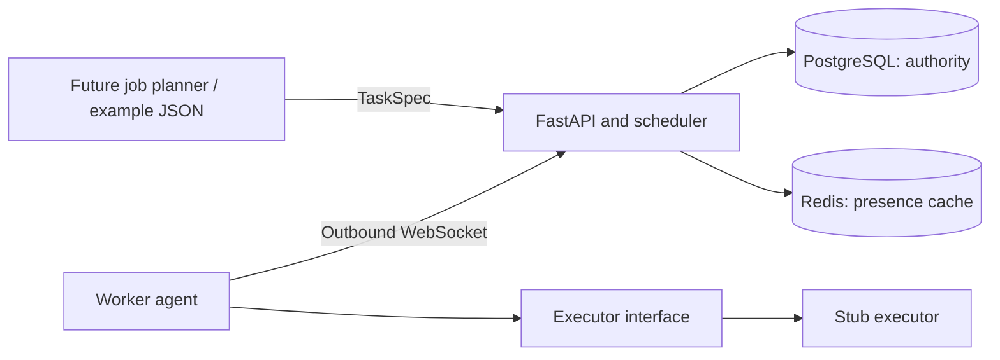

# Architecture

The control plane accepts already-split tasks and schedules independent workers.

## Scope and stack

- React + TypeScript + Vite dashboard; SSE updates and HTTP mutations.
- Python 3.12–3.14, a FastAPI server, and an asyncio worker agent.
- Pydantic task/protocol models, asyncpg for PostgreSQL, redis-py for optional
  presence caching, and the `websockets` client for the worker connection.
- Versioned JSON over a persistent WebSocket connection. This implements the
  WebSocket transport from the proposed stack; gRPC is deferred.
- PostgreSQL owns task specifications, assignment generations, leases, worker
  sessions, results, and transactional audit events.
- Redis is an optional, disposable presence cache. Losing Redis neither grants
  ownership nor expires work. Registry responses use PostgreSQL.
- A cancellable stub executor waits and returns a deterministic JSON result.
  It does not launch Blender, run submitted code, or use a GPU.

There is no job planner, aggregation, object storage integration,
training coordination, billing, or Runpod provisioning in this prototype.



## Two extension boundaries

[`shared/protocol.py`](../backend/src/orchestrator/shared/protocol.py) contains:

```python
class TaskQueue(Protocol):
    async def submit(self, specs: list[TaskSpec]) -> list[Task]: ...

class Executor(Protocol):
    kind: str

    async def execute(self, spec: TaskSpec, report: Callable[[float], None]) -> JsonValue: ...
```

The planner submits complete, independent tasks through `TaskQueue` in-process
or `POST /v1/tasks` remotely. A batch is atomic, with 1–100 tasks. IDs are globally
unique idempotency keys: resubmitting the same spec returns existing state;
changing the spec under an existing ID returns HTTP 409. JSON property order and
whitespace do not affect this comparison.

`job_id` is correlation metadata, not a job lifecycle. Dependencies, splitting,
job-level completion, and output assembly belong to the future planner.

The worker advertises the configured executor's kind. The provided command only
supports `stub`; add an executor by implementing the protocol and passing it to
`Agent`. A real executor must honor asyncio cancellation promptly, keep blocking
GPU work outside the agent's event loop, and isolate any untrusted workload.
Call `report(percent)` to update progress sent in the next heartbeat.
Real file outputs should use immutable, attempt-specific object keys; the result
can then contain a reference that the server validates before accepting it.

## Lifecycle and correctness

1. An agent authenticates using a token bound to its worker ID and sends a
   versioned `hello` with runtime, available VRAM, and executor kinds.
2. The server creates a fresh session. Reconnecting under the same worker ID
   supersedes the old session and invalidates its active work transactionally.
3. An idle heartbeat triggers scheduling. Compatible queued tasks are considered
   FIFO. The server atomically reserves one worker slot, increments the task's
   generation, and sends the assignment.
   `target_worker_id` directs the first attempt to a specific worker. With
   `allow_failover=true` (the default), subsequent attempts may use any compatible
   worker; with `false`, every attempt stays pinned to that worker. A targeted
   task waits if its worker is busy or offline before the first assignment.
4. The worker acknowledges it within 10 seconds. It starts execution after the
   server accepts the acknowledgment.
5. Heartbeats every 5 seconds explicitly identify the active task and generation.
   Only valid running attempts get their lease extended by 45 seconds, capped at
   the task's execution deadline. Heartbeat responses are correlated with their
   request so an earlier idle heartbeat cannot revoke a newer assignment.
6. Successful completion requires the current worker, session, generation,
   running state, and an unexpired lease and execution deadline. An accepted
   result is immutable. Duplicate successful completion is a no-op.
7. The server reconciles once per second. Expired assignments retry up to the
   task's attempt limit. Explicit nonretryable failures become terminal. A fresh
   server resumes reconciliation from the database.

Worker state becomes unhealthy on a known disconnect or after 15 seconds without
a heartbeat, and offline after 45 seconds without a heartbeat. Connectivity is
independent of task state: an execution deadline catches a task that hangs while
its agent continues heartbeating. A worker stops its local task on connection
loss or missing heartbeat acknowledgments, but server-side fencing remains the
authority even if a worker does not stop.

Cancellation commits immediately in PostgreSQL, so a late result is rejected.
The connected worker learns of cancellation through its next heartbeat response
and cancels its executor. Cancellation is idempotent and leaves terminal tasks
unchanged. Completed results awaiting acknowledgment retain the worker's local
slot until accepted or revoked.

Worker transitions include affected task references; task events include the
assignment generation, worker, and reason where relevant. Events commit in the
same transaction as the state they describe. Generations and events retain
attempt history; there is no separate attempt analytics table yet.

All mutations take one PostgreSQL transaction advisory lock in this prototype.
That makes capacity and ownership transitions atomic across server processes,
with a unique partial index as an additional one-slot-per-worker constraint.
This intentionally serializes throughput; replace it with finer row locking
before fleet-scale deployment. No Redis TTL notification is used for recovery.

## API

The local demo combines these routes on one loopback listener. Hosted use splits
them: `orchestrator-public` serves the website and management API, while
`orchestrator-worker-gateway` exposes only health and the worker WebSocket through
Tailscale. Both share PostgreSQL. Supabase users must pass JWT verification and
the configured fleet-admin UUID allowlist. Backend data lives in a private
schema with no browser-role grants. See [networking setup](networking.md).

For Python automation, JSON CLI commands, and callable agent tools, see
[the agent interface guide](agent-interface.md). Quick discovery:
`uv run --project backend orchestrator tools` or `uv run --project backend orchestrator --demo workers`.

All `/v1` client endpoints require an approved Supabase user token/session, the
optional automation admin bearer token, or the restricted local demo cookie.
`/v1/worker` requires
the worker bearer token and `X-Worker-ID` header. `/healthz` is public and checks
database connectivity, not fleet readiness.

| Method | Route | Behavior |
| --- | --- | --- |
| POST | `/v1/tasks` | Submit `{ "tasks": [TaskSpec, ...] }` atomically |
| GET | `/v1/tasks` | Latest 500 tasks |
| GET | `/v1/tasks/{id}` | One task, including its accepted result |
| POST | `/v1/tasks/{id}/cancel` | Cancel a nonterminal task |
| GET | `/v1/workers` | Up to 500 durable worker records |
| GET | `/v1/events?after=0` | Next 500 audit events; advance using the last ID |
| GET | `/v1/snapshot` | One current dashboard snapshot for inspection |
| GET | `/v1/updates` | SSE snapshots on committed changes; resync on reconnect |
| GET | `/v1/worker` | Authenticated WebSocket upgrade |

Task requirements are exact runtime (`cpu`, `cuda`, or `mps`), executor kind,
and minimum available VRAM in MiB. Capacity is deliberately one task per worker.
Hardware reports are configured via environment, not benchmarked or verified.
The CPU stub works on a future GPU pod without claiming that GPU execution was
validated. `WORKER_PAUSED=true` connects without taking tasks; changing it
requires restarting this prototype agent.

## Later Runpod use

This repository change creates no pods and includes no provisioning commands.
When validation is authorized, install this Python package on each pod with a
different worker ID and token. Configure those identities in the server's
`WORKER_TOKENS` map. Expose the control plane through a TLS endpoint and set
`SERVER_URL=wss://<control-plane>/v1/worker` on each pod. Workers need outbound
connectivity only. Non-loopback plaintext WebSocket URLs are rejected by the
agent. The server expects TLS termination upstream when exposed remotely.
The container's default command is `orchestrator-server`; overriding its command
with `orchestrator-worker` starts the agent instead.

## Limits to address before expanding scope

- Shared admin credential and a configured worker-token map, not tenant auth or
  dynamic enrollment. Use separate tokens per identity and one agent per ID.
- No real workload sandbox yet; the built-in executor only waits and hashes JSON.
  Remote hardware and result honesty are not established by this protocol.
- No GPU discovery, score model, multiple slots, transfer/cache management,
  or object-storage output validation.
- Executors must yield to asyncio and cooperate with cancellation. A real GPU
  executor should supervise a separate process with explicit shutdown handling;
  this prototype does not yet provide that process runner.
- Lease timing is fixed. Retry attempts are bounded but have no per-task backoff.
- HTTP lists are capped; only events have a cursor. No metrics endpoint.
- Schema creation is idempotent for the initial schema, not a versioned migration
  framework. There is no audit retention or task cleanup policy yet.
- The coarse transaction lock and frequent durable heartbeats prioritize clarity
  over scale. Capacity, failure recovery, and shutdown remain unvalidated.
