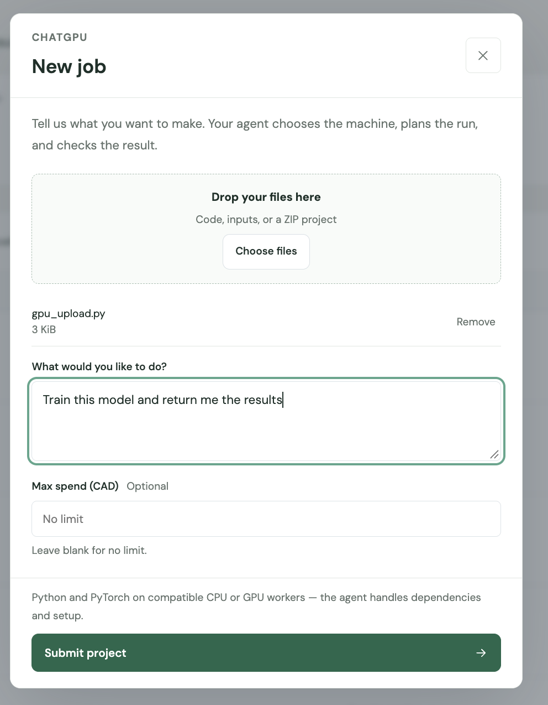
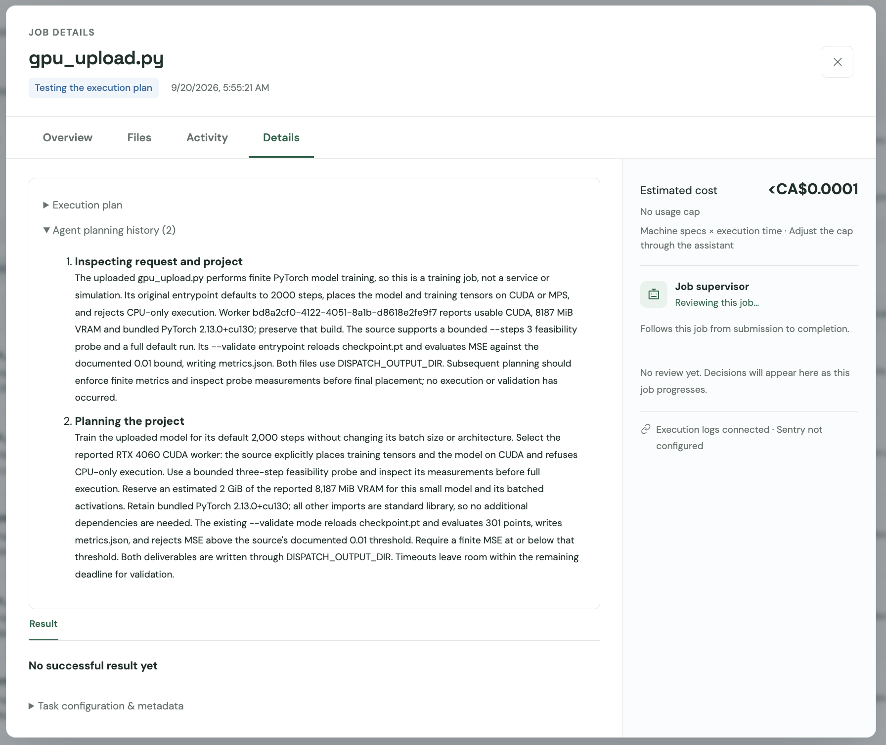
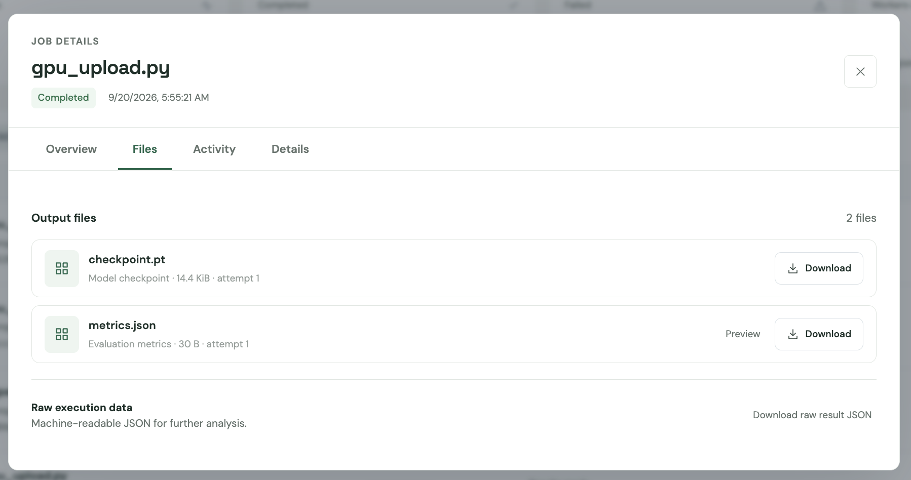
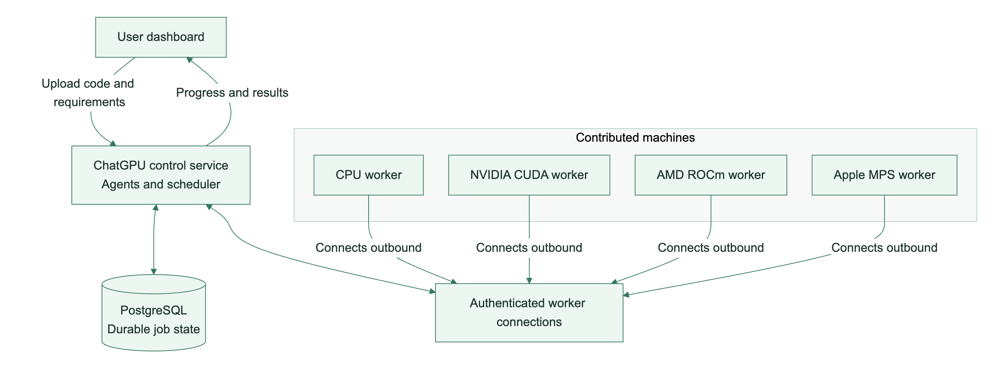
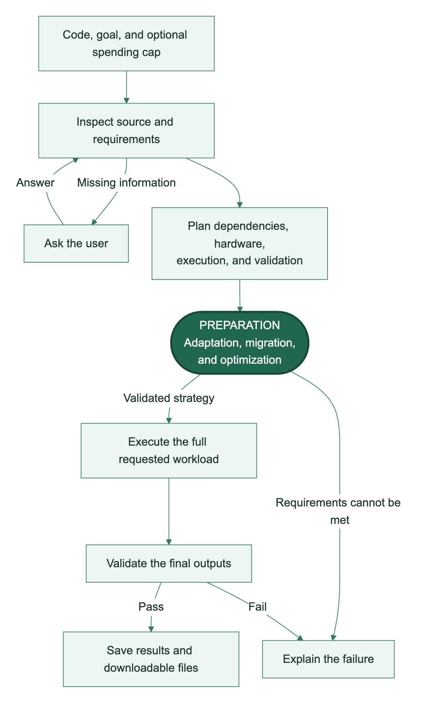
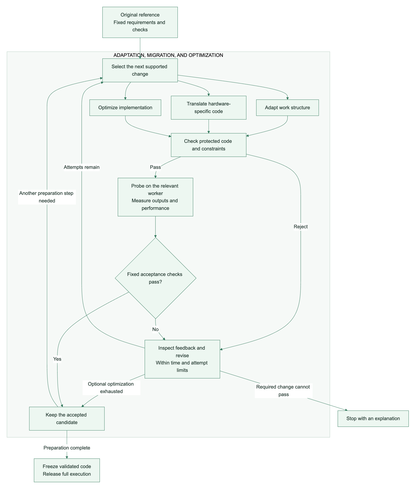
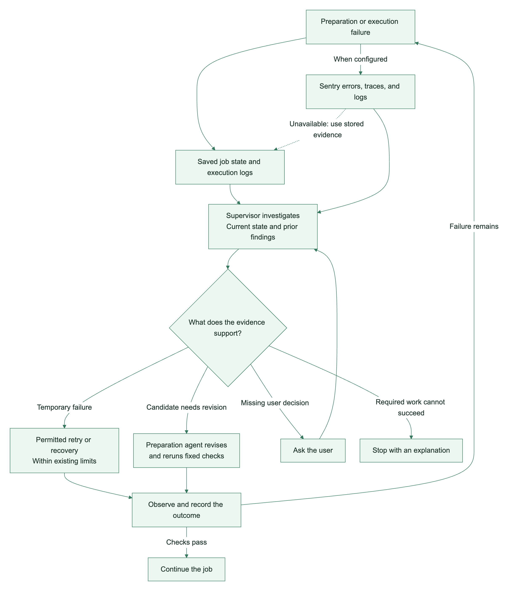
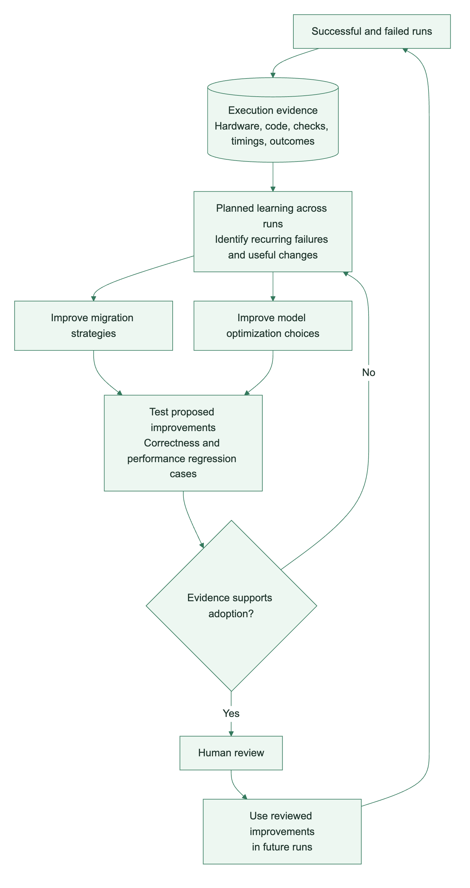
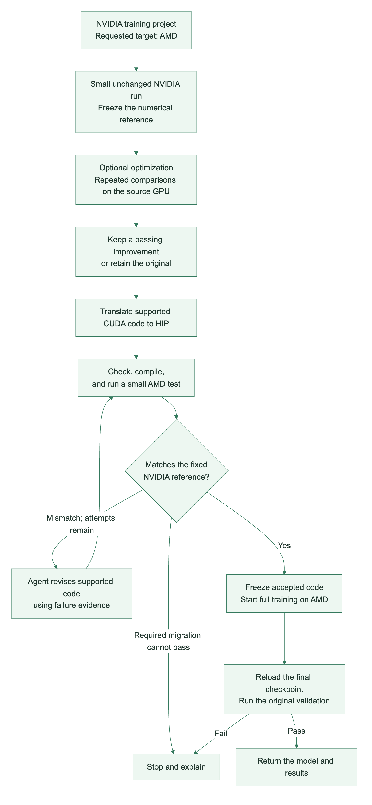
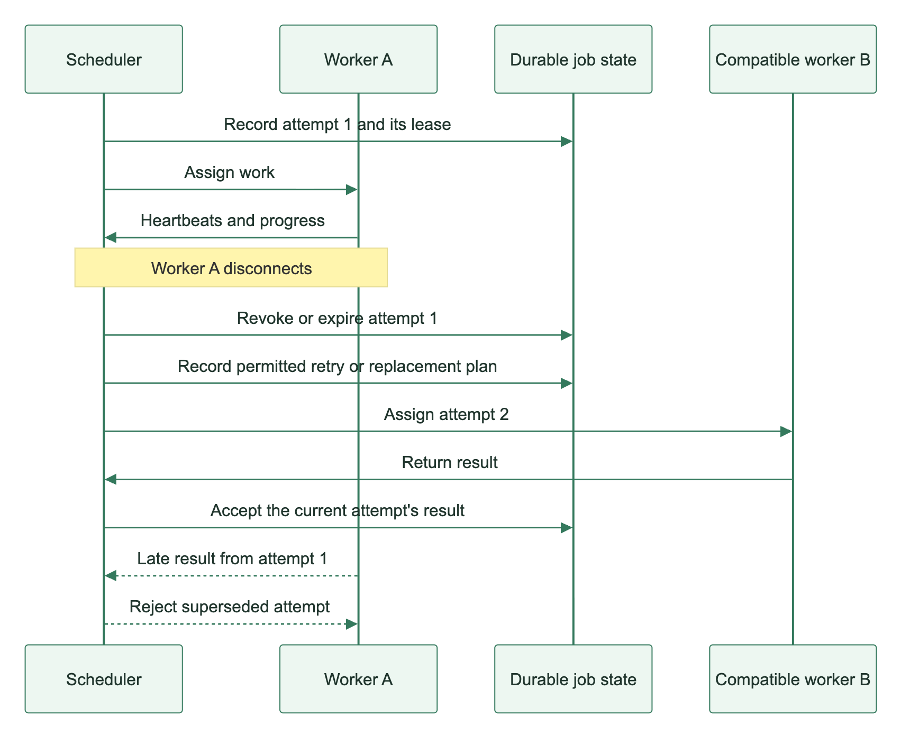

## **Bring your code. ChatGPU adapts, optimizes, and runs it across a network of idle GPUs.**

We want people to rent out their GPUs when they aren't using them, making spare capacity, including consumer chips, available for training, simulations, and experimentation.

But personal machines can disconnect at any time and vary enormously in hardware and software. Users cannot tune their code for every possible device. Our agents handle that adaptation, checking changes against the original behaviour and using telemetry to troubleshoot failures and improve future runs.

## How to use it

1. **Create a new job.** Drop in any relevant files, tell ChatGPU what you want it to do, and click **Submit project**.

   

2. **Watch your agent work.** Follow along as it plans, tests, and supervises your run.

   

3. **Reap the rewards.** Review your results and download the outputs, such as your trained model and evaluation metrics.

   

## How it works

### Network

Each contributor runs a worker that connects to ChatGPU and reports its runtime,
memory, and supported workloads. Workers initiate authenticated outbound
connections, so contributors do not need to expose their computers to incoming
connections. Owners can pause their workers when they need their machines back.

The scheduler matches tasks to compatible, available workers. Supported
environments include CPU, NVIDIA CUDA, AMD ROCm, and Apple MPS, with eligibility
checked for each workload. The dashboard receives live updates, while PostgreSQL
stores job state, assignments, accepted results, and execution history.

### Agent to run: from request to results

We use **GPT-6 Astra** to power job planning and run supervision.
The planning agent reads the uploaded code and the user's request, identifies
dependencies and output requirements, and chooses compatible hardware. If a
requirement is unclear, it asks the user. It can also consult specialist agents
about dependencies, parallelization, and validation before deciding on a plan.

**Adaptation, migration, and optimization form one preparation stage.** The agent
applies the supported steps the workload needs, using small worker runs to
measure and validate its choices. Once preparation passes, workers execute the
full workload, validate its outputs, and save the results for download. A run
supervisor follows progress and investigates problems throughout the pipeline.

#### Inside adaptation, migration, and optimization

The loop starts with the original program and fixed acceptance criteria.
Candidates pass code checks before running on the relevant hardware. Compilation
errors, numerical differences, and performance measurements become feedback for
the next proposal. The agent can revise supported parts of the implementation
within its budget, while the definition of a correct result stays fixed.

- **Adaptation** changes how work is organized. Independent computations can be
  divided into batches, with checks that their combined results agree with the
  original on the tested cases.
- **Migration** adapts supported hardware-specific code for a different chip.
  The target's numerical results are checked against a reference from the
  original environment.
- **Optimization** compares alternative implementations using repeated
  measurements. A candidate must preserve the required behaviour and meet its
  performance criteria to replace the accepted version.

A rejected optional optimization leaves the last accepted code in place. A
required adaptation or migration must pass before full execution can begin.
Accepted code is frozen for the full run, and the user's requested workload and
quality requirements remain unchanged. The transformations available depend on
the workload and runtime; code that already fits can proceed without rewriting.

### When a run fails: the Sentry feedback loop

We use **Sentry** as our telemetry platform across the system, collecting errors,
logs, traces, and performance measurements. Failures can come from lost workers,
missing dependencies, compilation errors, resource limits, or outputs that fail
validation. ChatGPU records the affected job, worker, and attempt so the supervisor
can connect Sentry evidence to the run it is investigating.

The supervisor reads this evidence alongside current job state and its saved
findings. Its response depends on the cause:

| What happened | How the system responds |
| --- | --- |
| A temporary failure or worker loss | Retry eligible work within existing limits, or arrange compatible replacement capacity where the execution policy permits it. |
| A candidate fails compilation or validation | Feed the evidence back to the preparation agent for a bounded revision. Keep the accepted version when an optional optimization is rejected. |
| A required change cannot pass, or the workload cannot fit | Stop with an explanation, or ask the user for a missing decision. Preserve the original output and quality requirements. |
| Sentry is unavailable | Continue investigating from stored execution logs and job state. |

The planner owns code adaptation and validation; the supervisor manages the
run's supported recovery actions. Every action is checked against the job's scope
and limits, and the next observation establishes whether recovery worked.
Findings, actions, and follow-ups persist across supervisor runs. The scheduler
handles heartbeats, leases, and routine retries independently of model calls.

### Using telemetry to improve model optimization and migration

The same execution data can help us improve future runs. Preparation records
include hardware and runtime details, original and candidate code identities,
numerical checks, timings, rejection reasons, and final outcomes. Successful,
failed, skipped, and fallback outcomes are saved, with structured Sentry Logs
providing a way to search and investigate them.

**We plan to use this evidence to improve our model optimization and migration
algorithms:** identify which changes help particular workloads and chips, learn
from recurring compatibility failures, and turn those failures into regression
cases. Candidate changes can then be evaluated against both correctness and
performance evidence before adoption. A faster result must still meet the
original quality requirements.

Our existing development agent already investigates recorded incidents and
proposes fixes with tests for human review. We want to build on that foundation
with better migration strategies and optimization choices informed by previous
runs. Broader learning across runs and training agents on these records are
future uses of the data.

### Example flow: NVIDIA training code on an AMD GPU

A user brings a training project with supported GPU code written for NVIDIA and
asks to run it on AMD. The model, data, training settings, and acceptance criteria
must stay consistent. With compatible source and target workers available, the
flow is:

1. **Establish a reference.** Run a small, unchanged workload on NVIDIA and save
   its numerical results and measurements.
2. **Optimize where useful.** Test supported implementation changes against the
   original on the source GPU. Keep a candidate only when repeated measurements
   and correctness checks justify it; otherwise, retain the original.
3. **Migrate the accepted code.** Translate supported CUDA code to HIP for AMD.
   Compilation and execution feedback guide any permitted revisions.
4. **Validate on the target.** Run the bounded workload on AMD and compare its
   results with the fixed NVIDIA reference. A failed required migration returns
   to the revision loop within the job's limits, or stops with an explanation.
5. **Run the full job.** Freeze the validated code and train on AMD for the
   requested workload. Reload and evaluate the final checkpoint, then return
   the model and results if they pass the original checks.

The small preparation runs establish evidence for the execution strategy. The
full training run still performs the requested work, and its final result must
satisfy the original validation requirements. This flow prepares code for the
target before the full run begins.

### Keeping runs recoverable and under user control

Worker assignments have renewable leases. A machine must keep reporting to
retain ownership. If it disappears, eligible work can be retried or replanned
within the job's limits. Each attempt has a distinct identity, so a late result
from an old worker cannot overwrite the accepted result. Work tied to a specific
validated machine must continue to respect that placement requirement.

Plans, execution history, validation evidence, and accepted files remain
available after worker cleanup. Users can inspect what happened, download their
outputs, or cancel outstanding work. Optional spending caps are expressed in
Canadian dollars and stop work when estimated usage reaches the cap. Enforcement
is periodic, so these are soft limits. Current estimates use CPU/RAM rates;
owner payouts and payment processing remain future marketplace work.

The same upload flow can host supported Python HTTP services when the user asks
for an endpoint. Readiness checks control routing, and compatible replacement
workers can restart the service behind the same authenticated URL.

Editable Mermaid diagram sources are included alongside the images in [assets/devpost](assets/devpost/).
