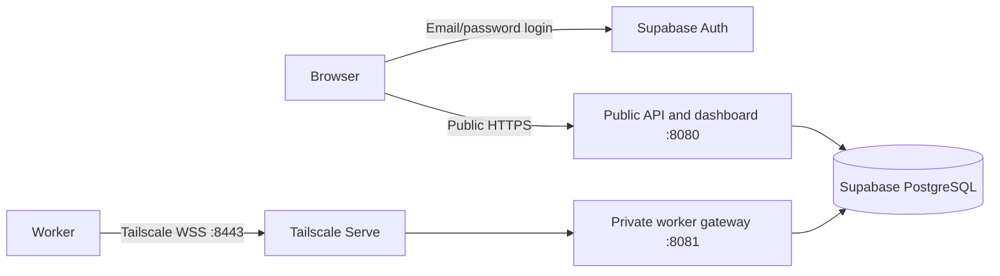

# Public website, private workers, Supabase



Browsers do not need Tailscale. The server host and workers join the same
tailnet. Both server processes use the same database and worker enrollment map.
Only the worker gateway registers `/v1/worker`; only the public process registers
the dashboard and management API. Both listen on loopback behind their proxies.

## Supabase configuration

The repository-root `.env` is ignored by Git. Start with the root `.env.example`.
Run commands below from the repository root, loading `.env`.

- `SUPABASE_URL`: project URL.
- `SUPABASE_PUBLISHABLE_KEY`: the `sb_publishable_...` key. It is intentionally
  sent to the browser. Secret/service-role keys are rejected and are not needed.
- `SUPABASE_ADMIN_IDS`: comma-separated Auth user UUIDs allowed to manage this
  shared fleet. Create a confirmed email/password user under Authentication →
  Users and copy its UUID. Signing up alone never grants fleet access. There is
  no self-signup UI. All approved users currently have the same permissions.
- `DATABASE_URL`: the direct or **Session pooler** URI from Connect, with the
  password URL-encoded and `sslmode=verify-full`. Transaction pooling on port
  6543 is rejected because the change feed needs a persistent `LISTEN` session.
  Direct connections normally require IPv6; Session pooler supports IPv4.
- Download the database CA from Database Settings → SSL Configuration when
  needed, and append `&sslrootcert=/absolute/path/to/certificate.crt` to the URI.
  Verification is not disabled if the certificate is missing.
- `DATABASE_SCHEMA=orchestrator`: a dedicated backend schema. Keep it **out** of
  Supabase's exposed Data API schemas. Startup creates the tables, revokes
  `PUBLIC`, `anon`, and `authenticated` privileges, and enables RLS without
  browser policies. Existing tables in other schemas are not migrated.
- `WORKER_TOKENS`: JSON mapping worker IDs to distinct random tokens of at least
  24 characters. These remain server/worker secrets, separate from user login.
- `PUBLIC_ORIGIN`: your exact website origin, such as `https://fleet.example.com`.
  HTTP, paths, queries, and embedded credentials are rejected.
- `ADMIN_TOKEN`: optional automation bearer credential. Leave it unset to require
  Supabase users for management calls. It cannot create browser sessions.

Use an asymmetric Supabase signing key (ES256 or RS256). The backend verifies
signature, issuer, audience, expiry, authenticated role, and user UUID against
the project's JWKS. Public signing keys are cached for 60 seconds. Legacy HS256
tokens and anonymous users are rejected. Browser sessions use the Supabase SDK;
the backend copies only the verified access token into a Secure, HttpOnly,
SameSite cookie for native SSE. No tokens are placed in URLs. Refresh uses the
SDK and a same-origin exchange; browser mutations require an exact Origin.
Sign-out clears the browser session. Previously copied access tokens remain
valid until their Supabase expiry; this is not immediate per-token revocation.

## Start the two servers

Build and install first:

```sh
npm --prefix frontend ci
npm --prefix frontend run build
uv sync --project backend --frozen
```

Start each in its own terminal on the host running your reverse proxies:

```sh
uv run --project backend --frozen --env-file .env orchestrator-public
uv run --project backend --frozen --env-file .env orchestrator-worker-gateway
```

Both initialize the same schema and reconcile leases using the existing
transaction lock. PostgreSQL notifications keep dashboard updates flowing
between processes. `PUBLIC_PORT` defaults to 8080; `WORKER_PORT` defaults to
8081. The commands deliberately bind to `127.0.0.1`. The original
`orchestrator-server` / demo launcher remains for local combined operation and
rejects `PUBLIC_ORIGIN` so it cannot accidentally serve both surfaces publicly.

## Public website

Point a public DNS name at the chosen host, and terminate HTTPS with a reverse
proxy. [The example Caddyfile](../deploy/Caddyfile.example) forwards only to
port 8080 and preserves the original Host. Set `PUBLIC_DOMAIN` for Caddy and
the matching `PUBLIC_ORIGIN` for Python. Permit public TCP 80/443 for Caddy;
keep 8080/8081 inaccessible from outside the host. Run the proxies and Python
processes as supervised services on a deployment host.

```sh
PUBLIC_DOMAIN=fleet.example.com caddy run --config deploy/Caddyfile.example --adapter caddyfile
```

The login page and bundled assets are public. Fleet data and actions require
authentication. WebSocket upgrades to `/v1/worker` on this address are rejected
even with a correct worker token. Do not proxy the worker port through this site.
The browser receives no database password, worker token, or automation key.

## Tailscale worker connections

Install Tailscale on the server and each worker, sign into the intended tailnet,
and permit approved workers to reach the server on TCP 8443 in tailnet policy.
Use HTTPS-enabled MagicDNS and the server's full `.ts.net` name.
Inspect existing Serve configuration before changing it:

```sh
tailscale status
tailscale serve status
tailscale serve --bg --https=8443 http://127.0.0.1:8081
```

On each worker, use its own ignored environment file:

```dotenv
SERVER_URL=wss://YOUR-SERVER.YOUR-TAILNET.ts.net:8443/v1/worker
WORKER_ID=worker-1
WORKER_TOKEN=replace-with-its-enrolled-token
WORKER_RUNTIME=cpu
WORKER_VRAM_MIB=0
```

```sh
uv run --project backend --frozen --env-file /path/to/worker.env orchestrator-worker
```

Use Serve, not Funnel, for this private entry point. Workers still authenticate
with their per-worker tokens. Do not send them Supabase database credentials.
Test from a second tailnet machine: `/healthz` works on the private address,
`/v1/tasks` returns 404, and a worker connects only with its enrolled token.
Verify the public dashboard receives its registration and can dispatch a task.
Live Tailscale/public HTTPS deployment requires the host and domain to be chosen;
local tests do not establish live tailnet connectivity.

References: [Supabase connections](https://supabase.com/docs/guides/database/connecting-to-postgres),
[Supabase signing keys](https://supabase.com/docs/guides/auth/signing-keys),
[Tailscale Serve](https://tailscale.com/docs/reference/tailscale-cli/serve),
[Caddy reverse proxy](https://caddyserver.com/docs/caddyfile/directives/reverse_proxy).
