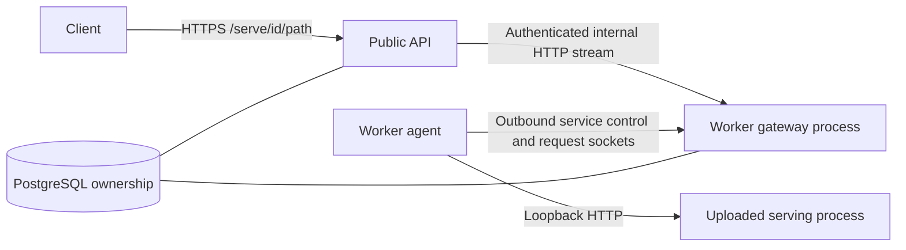

# Service mode implementation plan

Status: design followed by the first implementation, 2026-09-19. See
[the service hosting guide](service-hosting.md) for the implemented contract and setup.

Implementation decisions made while integrating with the existing tree:

- Persistent service state lives in `hosted_services` alongside existing project
  tables; tasks, worker leases, scheduling, logs, and supervisors are shared.
- The reverse transport uses a persistent health channel plus a bounded pool of
  one-request data sockets. This avoids a multiplexed request-control protocol.
- Single-file entrypoints are inferred deterministically; ambiguous entrypoints use
  the existing clarification UI. Service runtime/settings are explicit, and lifecycle
  recovery needs no model calls. The existing supervisor remains available for diagnosis.
- Stop/Restart revoke immediately. Graceful draining is deferred, and current requests
  may be interrupted. One worker-gateway process is the supported topology.
- The UI/API, CPU fixture, and model launcher templates are implemented. The Apple
  Metal example has also served real model responses. The detail below records the
  original design targets; the hosting guide describes the final contract.
- The implementation is self-contained on the existing simulation upload flow.
  The separate training/rendering adapters and output-download changes are excluded.

## Outcome and scope

Extend the existing uploaded-project flow with `execution_mode: job | service`.
Users upload serving code, select Service, and receive a stable authenticated
endpoint. The existing orchestration system selects a worker, runs the program,
tracks execution, and recovers failures. Service success means being ready and
remaining available until stopped or expired.

First release: one Python HTTP service on one worker, HTTP request/response and
SSE response streaming, automatic replacement, existing fleet-admin access,
and an optional lifetime. The service reserves the worker's existing single
execution slot. Dependencies must already be available on the selected worker.
The serving code owns model loading and inference; the gateway is model-agnostic.

GPU discovery/access remains the other agent's work. This can be developed and
verified with a CPU HTTP fixture. Multiple replicas, autoscaling, model sharding,
arbitrary TCP/WebSocket application protocols, public anonymous endpoints,
custom domains, rolling releases, and persistent application disks are follow-ups.

## Existing code to reuse and extend

| Area | Current boundary | Required change |
| --- | --- | --- |
| Upload and planning | `preprocessing/models.py`, `routes.py`, `service.py` | Add execution mode and service planning; retain file inspection and clarification |
| Durable project state | `preprocessing/store.py`, `server/db/schema.sql` | Store desired service state, lifecycle, revision, endpoint identity, and restart policy |
| Assignment and leases | `shared/protocol.py`, `server/db/store.py`, `server/scheduler.py` | Permit explicitly identified persistent assignments; retain fencing and capacity ownership |
| Worker execution | `worker/agent.py`, `worker/executors/python_project.py` | Reuse workspace/process management; add serving-process supervision |
| Supervisor | `supervisor/service.py`, `supervisor/store.py`, `supervisor/tools.py` | Interpret readiness/health, service actions, and terminal states |
| API assembly and worker transport | `server/app.py`, `server/worker_connection.py`, `worker/tunnel.py` | Register service transport and an explicit bridge between public and worker processes |
| Product UI | `SimulationComposer.tsx`, `SimulationDetails.tsx`, `TaskList.tsx`, `api/client.ts` | Job/Service selector and endpoint/status controls |

Current constraints that cannot be bypassed with a checkbox alone:

- `TaskSpec.timeout_seconds` is mandatory and capped at 24 hours; the worker
  wraps all execution in that timeout. Server validity and lease renewal require
  a non-null execution deadline.
- Uploaded projects have an overall non-null deadline, defaulting to 30 minutes
  with a two-hour submission limit. Several queries enforce it independently.
- Program execution waits for exit, runs a validator, and collects files afterward.
- Preprocessing currently starts only when the model client is configured.
  Established services must keep running/recovering without an available LLM.
- Public API and worker gateway are separate processes. Their in-memory socket
  registries cannot be shared merely through `app.state`.

## Submission and user flow

1. Add Job/Service selection to the existing upload form; default to Job.
2. Service submissions use the same files, description, idempotency key, planning
   history, and clarification flow. Execution mode is separate from workload
   classification: choosing Service bypasses finite program-output planning.
3. Inspect the original code and produce a frozen service plan: Python entrypoint,
   argument array, working directory, runtime/VRAM requirements, local port,
   readiness path, startup timeout, request limits, and optional lifetime.
   Reuse the current file/argument validation; do not construct shell commands.
4. The program binds to loopback and honors `DISPATCH_SERVICE_PORT`. The planner
   may use an existing port argument through a placeholder; if the code cannot
   accept the contract, request clarification rather than silently rewriting it.
5. `GET /health` returning 2xx is the default readiness contract. It must reflect
   model readiness, not just a listening socket. An optional bounded application
   probe can verify a sample inference. File outputs/validators are not required.
6. Return an endpoint identity immediately, with status Starting/Pending until
   ready. The detail view shows endpoint, state, worker, uptime, restart history,
   logs, and Stop/Restart. Service mode replaces progress and output-download UI.

Proposed API shape:

- `POST /v1/jobs`: existing upload plus `execution_mode` and optional `service`
  settings; omitted mode preserves current jobs and `/v1/simulations` behavior.
- `GET /v1/jobs/{id}`: add service configuration, desired/observed state, endpoint,
  latest readiness time, current attempt, restart count, and last failure.
- `POST /v1/jobs/{id}/actions`: extend existing idempotent actions with service
  stop/restart. A restart replaces the process using the same frozen plan and URL.
- `/serve/{id}/{path}`: authenticated application endpoint. For an inference API,
  the client base URL can be `/serve/{id}/v1`.

Service configuration and policy participate in submission hashing. Reusing an
ID with different code, mode, or settings remains a conflict.

## Lifecycle and correctness

Keep the current root project and task ownership model. Add a service-state
record keyed by job ID rather than inventing another scheduler or renaming the
existing simulation tables as part of this feature. Keep desired state
(`running`/`stopped`) separate from observed state:

`planning → pending → starting → ready → draining → stopped`

Failures transition to `restarting → pending`; repeated failures transition to
`failed` with automatic restarts suspended until an explicit Restart action.
Readiness does not complete the root task or close its supervisor.

- Introduce a discriminated persistent task variant, kind `python_service`.
  Ordinary jobs still require finite execution deadlines. Only validated service
  assignments may have no lifetime deadline; audit every deadline check, including
  bundle authorization, reconciliation, cancellation, and supervisor queries.
- Keep finite planning/setup, per-attempt startup, per-request, and drain deadlines
  separate from optional service expiry. Expiry is an absolute persisted time;
  a crash/restart must not reset it. A healthy service is never restarted just to
  renew a task timeout.
- Reuse worker ID, session ID, task ID, generation, short leases, and the existing
  one-slot capacity constraint. Readiness and tunnel registrations carry the same
  identity and are rejected when stale. Workers stop local execution on lost
  ownership as they already do.
- Run service reconciliation from the deterministic scheduler, independently of
  model calls. It transactionally ensures at most one active attempt, selects a
  compatible idle worker from the frozen requirements, renews necessary placement
  reservations, and honors stop/expiry/restart policy. Do not double-schedule from
  the preprocessing loop. A service attempt uses one execution attempt; its parent
  service owns replacement policy across distinct tasks and retains history.
- Proposed defaults: readiness every 5 seconds with a 2-second timeout; remove
  routing on the first failed check and restart after three consecutive failures.
  Startup timeout defaults to 10 minutes and is configurable for model loading.
  Backoff starts at 1 second and doubles to 60 seconds with jitter. Five failures
  within 10 minutes suspend automatic restarts. No compatible worker means Pending,
  not repeated failed attempts. Reset backoff after 10 healthy minutes.
- On Stop, immediately deny new requests and suppress replacements, then drain
  existing requests for up to 30 seconds. Keep a drain-only lease during this
  interval; afterward revoke the attempt and terminate its process group, escalating
  to kill after a bounded grace period. Expiry follows the same policy. Lost leases
  or supersession revoke immediately. Release capacity only according to existing
  ownership rules; late readiness cannot resurrect a stopped service.
- The LLM supervisor handles inspection, clarification, diagnosis, and deliberate
  recovery changes. A healthy idle service is not a stalled job. Wake on meaningful
  transitions/repeated failures rather than calling the model for each health check
  or request. Service health/restarts continue during model API outages.

Implement service lifecycle logic in focused modules (for example
`preprocessing/services.py`, `server/services.py`, and
`worker/executors/python_service.py`) while sharing existing orchestration code.

## Gateway and transport

Use outbound worker connections so hosting works with the current network model.
The service process itself needs no public listener or inbound worker port.

For the first version, use a separate persistent service-control WebSocket and
one outbound data WebSocket per admitted HTTP request. The control channel carries
readiness and bounded request-open/cancel notices. Each data channel carries one
request/response with framed metadata and binary body chunks. This avoids sharing
large inference traffic with worker heartbeats and avoids implementing multiplexed
flow control for the first release. Connections can use the existing tunnel helper's
`open_socket()` to the same gateway host. Define this as a separately versioned
service protocol in `shared/service_protocol.py`.

The public API explicitly streams to an internal bridge in the worker gateway;
it never looks up another process's local sockets. Configure the bridge URL and
a backend-only bridge credential, excluded from uploaded subprocess environments.
Use loopback in the current bundled deployment and authenticated TLS if separated
across hosts. The gateway owns the service sockets and validates current ownership
again before dispatch. First release supports one worker-gateway process; document
and enforce that topology. Multiple gateway processes require owner-aware routing
and are a subsequent change, not something the shared database already supplies.

Gateway behavior:

- Require existing fleet-admin authentication, including origin protection for
  cookie-authenticated mutations. Do not forward platform credentials, cookies,
  internal tokens, or hop-by-hop headers to uploaded code. Strip application
  Set-Cookie responses and do not follow upstream redirects. Support generic API
  methods, not CONNECT, protocol upgrades, or arbitrary destination URLs.
- Fix the destination to the registered service's loopback port. Scope every
  request ID/data-socket handshake to the active assignment and allow one attachment.
- Route only while the assignment lease, worker freshness, readiness report, and
  service-control connection are valid. Recheck/revoke active streams on ownership
  changes and disconnects; PostgreSQL is the authority. Fail closed during loss of
  authority. Control disconnection withdraws routing immediately, with a bounded
  reconnect grace inside the current lease before restarting the process.
- Preserve path/query, status, safe headers, and binary response bytes. Stream SSE
  without buffering the whole response at any hop, including the HTTPS proxy.
- Start with at most 4 in-flight requests per service, no unbounded pending queue,
  64 KiB chunks and bounded queues, a 1 MiB request-body cap, 30-second request
  connection setup, and a configurable 300-second total request timeout. Keep these
  separate from the service lifetime. Reject overflow with 429 and large bodies
  with 413. Apply backpressure across both HTTP hops and the request data socket.
- Return 503 when not ready, 502 for a failed upstream connection, and 504 for a
  request timeout before response headers. After headers/stream bytes are sent,
  terminate the stream on failure. Never replay a request automatically; arbitrary
  uploaded HTTP handlers may have side effects even before returning headers.
- Client disconnect propagates cancellation and closes upstream sockets. Whether
  inference computation stops depends on the uploaded server handling cancellation.
- A stopped service keeps its endpoint identity but returns 503. Replacement uses
  the same URL. In-flight requests cannot migrate between processes.

Bounded transport queues are necessary for backpressure; see the official
[websockets memory guide](https://websockets.readthedocs.io/en/stable/topics/memory.html).
Use the installed ASGI stack's streaming/disconnect mechanisms and verify end-to-end
cancellation; see [Starlette requests](https://www.starlette.io/requests/).

## Model files and compatibility

The first HTTP fixture needs no external artifacts. A model deployment must pin
the weights/adapter, tokenizer, configuration, and serving dependencies and ensure
they are available on every replacement candidate. Start with an explicitly
configured worker model directory or a versioned download performed by the uploaded
startup code. If it cannot reconstruct the deployment on another worker, restrict
placement and report Pending when that worker is unavailable. A centralized model
registry/cache can be added after generic service hosting works. Existing large
upload limits and temporary workspace cleanup still apply; do not promise persistent
state across attempts. Fine-tuned model data and requests go to the selected worker.

Advertise `python_service` only from capable Python workers. Do not dispatch service
tasks to desktop/iOS or older workers. Negotiate new protocol fields or omit them
from legacy messages: existing models forbid unknown fields. Existing rows default
to Job; preserve finite-task validation, completion, uploads, and retries. Keep
service messages out of finite JSON result/output channels.

## Implementation sequence and acceptance

| Step | Deliverable | Acceptance evidence |
| --- | --- | --- |
| 1. Contracts and state | Mode, frozen service plan, migrations, lifetime/lease rules, single-owner reconciler | Ordinary jobs retain deadlines; service leases renew beyond startup; stop/restart races cannot produce two active attempts |
| 2. Worker runtime | Serving executor, readiness monitoring, shutdown, capability negotiation | CPU fixture becomes ready, stays running, survives an accelerated former deadline boundary, and leaves no child process after stop/worker death |
| 3. Gateway vertical slice | Public route, internal bridge, outbound control/data sockets, streaming and auth | Real HTTP through separate public/gateway processes reaches the worker; response chunks arrive before completion; cancellation and bounded buffering verified |
| 4. Loop and UI | Service planning branch, supervisor semantics, selector, endpoint/status/actions | Upload → Service → Ready → request → Stop works; missing port/entrypoint enters the existing clarification flow |
| 5. Recovery and model example | Restart/failover, expiry, integration fixture and a supported model example | Kill worker A and start on B at the same URL; stale A cannot serve; model outage does not stop deterministic recovery |

Use temporary PostgreSQL and real local worker subprocesses for the critical
integration tests. Include gateway restart, control loss with delayed stale frames,
readiness failure while worker heartbeats continue, crash-loop suspension, stop
during startup/backoff, expiry during streaming, slow consumers, client disconnect,
request overload, and one unauthorized/stale data-socket attachment. Test headers
and streamed bytes at the public endpoint, not only each proxy layer independently.
Run targeted existing job upload/execution/supervisor tests and frontend tests/build
to establish backward compatibility. A GPU smoke test follows only once the other
agent establishes a supported runtime; CPU transport tests do not prove model fit.

The first demonstrable milestone is one uploaded CPU HTTP service, reachable through
the stable authenticated URL using the real split server topology, stopped from the
dashboard, and automatically replaced on worker loss. Model hosting then uses the
same interface with serving code and accessible, pinned model files.

## Coordination

This tree contains ongoing edits to uploaded-program execution, planning, schema,
and UI. Implementation must integrate with those edits as they stand and coordinate
shared-file changes before beginning; do not reset, stash, or overwrite that work.
This planning change adds only this document.
